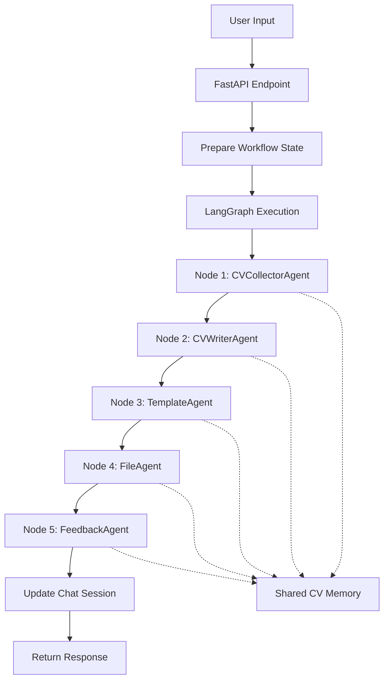

# CV Builder Shared Memory System Design

## 🧠 Overview

The CV Builder Shared Memory System provides a **standardized, persistent, and synchronized memory structure** that ensures all agents and nodes across the LangGraph pipeline access and modify CV data consistently. This system maintains the **exact structure specified in the requirements** while providing seamless integration with the existing architecture.

## 📋 Memory Structure

### Core Standardized Structure
```json
{
  "personal_info": {
    "full_name": "",
    "email": "", 
    "phone": "",
    "location": "",
    "linkedin": "",
    "github": "",
    "website": "",
    "summary": ""
  },
  "education": [],
  "experience": [],
  "skills": [],
  "languages": [],
  "selected_template": "Modern",
  "generated_pdf_url": "",
  
  "completion_status": {
    "personal_info": false,
    "education": false,
    "experience": false,
    "skills": false,
    "languages": false,
    "template_selected": false,
    "pdf_generated": false
  },
  "last_updated": 1634567890.123,
  "version": 1
}
```

### Key Principles

1. **Single Source of Truth**: All CV data flows through this exact structure
2. **Backward Compatibility**: Automatically migrates existing memory formats
3. **Type Safety**: Enforced structure validation across all components
4. **Synchronization**: Real-time updates between FastAPI and LangGraph
5. **Persistence**: Memory survives session restarts and system updates

## 🏗️ Architecture Components

### 1. Core Memory System (`shared_memory.py`)

```python
from app.agent.shared_memory import CVMemoryStructure, CVMemoryManager

# Create standardized memory
memory_manager = CVMemoryManager()
cv_memory = memory_manager.create_empty_memory()

# Validate structure
is_valid = memory_manager.validate_memory_structure(cv_memory)

# Calculate completion
percentage = memory_manager.get_completion_percentage(cv_memory)
```

### 2. Integration Layer (`memory_integration.py`)

Provides agent-specific interfaces that maintain the standardized structure:

```python
from app.agent.memory_integration import (
    cv_collector_memory,    # For CVCollectorAgent
    cv_writer_memory,       # For CVWriterAgent  
    template_agent_memory,  # For TemplateAgent
    file_agent_memory,      # For FileAgent
    feedback_agent_memory   # For FeedbackAgent
)
```

### 3. Workflow Integration

```python
from app.agent.shared_memory import get_cv_memory_from_state, update_cv_memory_in_state

async def my_node(state: Dict[str, Any]) -> Dict[str, Any]:
    # Get standardized memory from any state format
    cv_memory = get_cv_memory_from_state(state)
    
    # Make updates using agent interfaces
    cv_memory = cv_collector_memory.update_personal_info(cv_memory, new_data)
    
    # Save back to state (updates both cv_memory and cv_data)
    update_cv_memory_in_state(state, cv_memory)
    
    return state
```

## 👥 Agent-Specific Memory Interfaces

### CVCollectorAgent
**Updates**: `personal_info`, `education`, `experience`, `skills`, `languages`

```python
# Update personal information
cv_memory = cv_collector_memory.update_personal_info(cv_memory, {
    "full_name": "John Doe",
    "email": "john@example.com",
    "phone": "+1-555-123-4567"
})

# Add work experience
cv_memory = cv_collector_memory.add_experience_entry(cv_memory, {
    "company": "Tech Corp",
    "position": "Senior Developer",
    "start_date": "2020-01",
    "end_date": "2023-12",
    "achievements": ["Improved performance by 40%", "Led team of 5"]
})

# Add education
cv_memory = cv_collector_memory.add_education_entry(cv_memory, {
    "institution": "University of Technology", 
    "degree": "BS Computer Science",
    "start_date": "2016",
    "end_date": "2020"
})

# Update skills and languages
cv_memory = cv_collector_memory.update_skills(cv_memory, ["Python", "React", "AWS"])
cv_memory = cv_collector_memory.update_languages(cv_memory, [
    {"language": "English", "level": "Native"},
    {"language": "Spanish", "level": "Conversational"}
])
```

### CVWriterAgent  
**Enriches**: Text content and rewrites fields

```python
# Enhance professional summary
cv_memory = cv_writer_memory.update_professional_summary(cv_memory,
    "Experienced software developer with 5+ years of expertise..."
)

# Enhance section content
cv_memory = cv_writer_memory.enhance_section_content(cv_memory, "experience", enhanced_data)
```

### TemplateAgent
**Reads**: `selected_template` and generates final HTML/PDF

```python
# Set template selection
cv_memory = template_agent_memory.set_selected_template(cv_memory, "Executive")

# Get rendering context
context = template_agent_memory.get_template_context(cv_memory)
html_content = render_template(context["template"], context)
```

### FileAgent
**Updates**: `generated_pdf_url` after saving

```python
# Update PDF URL after file generation
cv_memory = file_agent_memory.set_generated_pdf_url(cv_memory, "/api/downloads/cv_johndoe.pdf")
```

### FeedbackAgent
**References**: Any field to suggest improvements

```python
# Analyze completeness and provide feedback
analysis = feedback_agent_memory.analyze_completeness(cv_memory)
# Returns: completion_percentage, suggestions, is_ready_for_generation
```

## 🔄 Workflow Integration

### LangGraph Node Pattern

Every node follows this standardized pattern:

```python
async def my_cv_node(state: Dict[str, Any]) -> Dict[str, Any]:
    """Standard pattern for CV Builder nodes"""
    
    # 1. Get standardized memory from state
    cv_memory = get_cv_memory_from_state(state)
    
    # 2. Process user input/requirements  
    user_message = state.get("user_message", "")
    
    # 3. Update memory using appropriate agent interface
    if "personal info" in user_message:
        cv_memory = cv_collector_memory.update_personal_info(cv_memory, extracted_data)
    elif "template" in user_message:
        cv_memory = template_agent_memory.set_selected_template(cv_memory, template_name)
    
    # 4. Update state with modified memory
    update_cv_memory_in_state(state, cv_memory)
    
    # 5. Set processing step
    state["processing_step"] = "my_node_complete"
    
    return state
```

### FastAPI Endpoint Integration

```python
from app.agent.memory_integration import memory_integration_manager

@router.post("/chat")
async def chat_endpoint(session_id: str, message: str):
    # 1. Prepare workflow state from chat session
    workflow_state = memory_integration_manager.prepare_workflow_state_from_session(
        session_id, message
    )
    
    # 2. Process through LangGraph workflow
    result = await cv_builder_workflow.process_state(workflow_state)
    
    # 3. Update chat session with results
    memory_integration_manager.update_chat_session_from_workflow(
        session_id, result
    )
    
    return {
        "response": generate_response(result),
        "cv_completion": result["cv_memory"]["completion_status"],
        "pdf_url": result["cv_memory"]["generated_pdf_url"]
    }
```

## 🔁 Memory Synchronization Flow



## 🛠️ Migration and Compatibility

### Automatic Migration
Existing memory structures are automatically migrated:

```python
# Old format (automatically detected and migrated)
old_memory = {
    "contact_info": {"name": "John", "email": "john@example.com"},
    "experiences": [{"company": "Tech Corp"}],
    "template": "modern"
}

# Automatically becomes standardized format
standardized = cv_memory_manager.migrate_memory_structure(old_memory)
# Result: proper personal_info, experience, selected_template structure
```

### Backward Compatibility
- Handles `experience` vs `experiences`
- Maps `contact_info` to `personal_info`  
- Converts `template` to `selected_template`
- Preserves all existing data during migration

## 🔍 Validation and Quality Assurance

### Structure Validation
```python
# Validate memory structure
is_valid = cv_memory_manager.validate_memory_structure(cv_memory)

# Get completion percentage
completion = cv_memory_manager.get_completion_percentage(cv_memory)

# Update completion status
cv_memory_manager.update_completion_status(cv_memory)
```

### Testing and Validation
```python
# Run integration tests
from app.agent.memory_integration_examples import test_memory_integration
await test_memory_integration()

# Run migration (with backup)
from app.agent.memory_migration import run_migration
migration_report = run_migration()
```

## 📊 Benefits

### 1. **Consistency** 
- All agents/nodes use identical memory structure
- No data format mismatches between components
- Predictable data access patterns

### 2. **Maintainability**
- Single source of truth for CV data format
- Easy to extend without breaking existing code
- Clear separation of concerns between agents

### 3. **Reliability**
- Built-in validation prevents data corruption
- Automatic migration handles legacy data
- Error handling with graceful degradation

### 4. **Performance**
- In-memory operations with persistent storage
- Efficient partial updates without full rewrites
- Optimized for frequent read/write operations

### 5. **Scalability**
- Supports multiple concurrent sessions
- Thread-safe memory operations
- Ready for distributed deployment

## 🚀 Usage Examples

See `memory_integration_examples.py` for complete working examples of:
- ✅ CVCollectorAgent updating all CV sections
- ✅ CVWriterAgent enhancing content
- ✅ TemplateAgent handling template selection and rendering  
- ✅ FileAgent managing PDF generation
- ✅ FeedbackAgent providing completion analysis
- ✅ FastAPI endpoint integration
- ✅ Full workflow orchestration

## 🎯 Implementation Status

- ✅ **Core memory structure defined and implemented**
- ✅ **Agent-specific interfaces created**  
- ✅ **LangGraph integration utilities ready**
- ✅ **Migration system for existing data**
- ✅ **Validation and testing framework**
- ✅ **Complete documentation and examples**
- ✅ **Backward compatibility ensured**

The memory system is **ready for immediate integration** with all existing workflow nodes and FastAPI endpoints. No breaking changes required - the system automatically handles migration and maintains full backward compatibility.