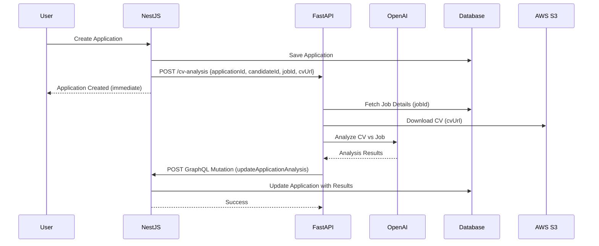

# FastAPI CV Analysis Service - Payload Specification

## 📨 Request from NestJS → FastAPI

### Endpoint
```
POST http://localhost:8000/cv-analysis
```

### Headers
```
Content-Type: application/json
```

### Payload
```json
### Payload
```json
{
  "application_id": "uuid",
  "candidateid": "uuid",
  "jobid": "uuid",
  "cv_link": "https://bucket.s3.amazonaws.com/cvs/file.pdf",
  "callbackUrl": "http://localhost:4005/api/graphql",
  "systemApiKey": "your-system-api-key-here"
}
```
```

### Field Descriptions

| Field | Type | Required | Description |
|-------|------|----------|-------------|
| `applicationId` | UUID | ✅ | The application ID to update with results |
| `candidateId` | UUID | ✅ | The candidate who submitted the application |
| `jobId` | UUID | ✅ | The job to analyze against (fetch full details from DB) |
| `cvUrl` | String | ✅ | S3 URL of the CV file to analyze |
| `callbackUrl` | String | ✅ | GraphQL endpoint to POST results back to |
| `systemApiKey` | String | ✅ | API key for authentication when posting results |

---

## 🔄 What the FastAPI Agent Should Do

1. **Fetch Job Details** from your database using `jobId`
   - Get title, description, requirements, skills, etc.
   - Get company information
   - Get custom `cvAnalysisPrompt` if configured

2. **Download CV** from S3 using `cvUrl`
   - Support PDF, DOCX, images (OCR)

3. **Extract Text** from CV

4. **Parse Candidate Info**
   - Name, email, phone, experience, skills, education

5. **Analyze CV** vs Job Requirements
   - Use GPT-4 to compare candidate profile with job requirements
   - Calculate match score (0-100)

6. **Generate Recommendations**
   - Interview questions specific to this candidate
   - Areas to explore in interview
   - Red flags or concerns

7. **POST Results Back** to NestJS (see below)

---

## 📤 Response from FastAPI → NestJS

### Endpoint
```
POST http://localhost:4005/api/graphql
```

### Headers
```
Content-Type: application/json
x-api-key: <SYSTEM_API_KEY from request>
```

### GraphQL Mutation
```graphql
mutation UpdateApplicationAnalysis($input: UpdateApplicationAnalysisInput!) {
  updateApplicationAnalysis(input: $input) {
    id
    cvAnalysisScore
    cvAnalysisResult
    interviewRecommendations
    cvRecommendations
  }
}
```

### Variables
```json
{
  "input": {
    "applicationId": "3d0e9b53-5e4d-4001-ad4d-52f92e158603",
    "score": 85,
    "results": "{\"match_score\": 85, \"strengths\": [...], \"gaps\": [...]}",
    "interviewRecommendations": "1. Ask about leadership experience...\n2. Discuss sales metrics...",
    "cvRecommendations": "Strong candidate with relevant experience..."
  }
}
```

---

## 🎯 Benefits of This Design

✅ **Lightweight Payload**: Only 6 fields, no massive job object  
✅ **Fresh Data**: Agent fetches latest job details from DB  
✅ **Fire & Forget**: NestJS doesn't wait, continues processing  
✅ **Independent**: FastAPI can retry, scale, and operate autonomously  
✅ **Observable**: LangGraph provides state tracking and debugging  
✅ **Flexible**: Easy to add more fields without changing NestJS code

---

## 🔒 Security Notes

- The `systemApiKey` is used for service-to-service authentication
- Only the FastAPI agent can call `updateApplicationAnalysis` mutation
- Protected by `ApiKeyGuard` in NestJS
- Store `SYSTEM_API_KEY` securely in both environments

---

## 🧪 Testing

### 1. Trigger CV Analysis
```bash
# Create application in NestJS
# Check logs for:
🚀 Triggering CV analysis for application: ...
👤 Candidate ID: ...
💼 Job ID: ...
📄 CV URL: ...
✅ CV analysis triggered successfully
```

### 2. FastAPI Processing
```python
# Your FastAPI endpoint should:
@app.post("/cv-analysis")
async def analyze_cv(payload: CVAnalysisRequest):
    # 1. Fetch job from DB
    job = await get_job(payload.jobId)
    
    # 2. Download CV from S3
    cv_buffer = await download_from_s3(payload.cvUrl)
    
    # 3. Run LangGraph workflow
    result = await cv_analysis_workflow.run({
        "applicationId": payload.applicationId,
        "candidateId": payload.candidateId,
        "job": job,
        "cv_buffer": cv_buffer
    })
    
    # 4. POST results back to NestJS
    await post_results(payload.callbackUrl, payload.systemApiKey, result)
    
    return {"status": "accepted"}
```

### 3. Verify Results
```graphql
query GetApplication {
  application(id: "...") {
    id
    cvAnalysisScore
    cvAnalysisResult
    interviewRecommendations
    cvRecommendations
  }
}
```

---

## 📝 Example Full Flow



---

## 🚀 Ready to Build!

Your NestJS backend is **100% ready**. Now build your FastAPI service with:
- LangGraph for workflow orchestration
- Direct database access to fetch job details
- S3 integration for CV downloads
- OpenAI integration for analysis
- HTTP client to POST results back

See `CV-ANALYSIS-SERVICE-INTEGRATION.md` for detailed implementation guide!
