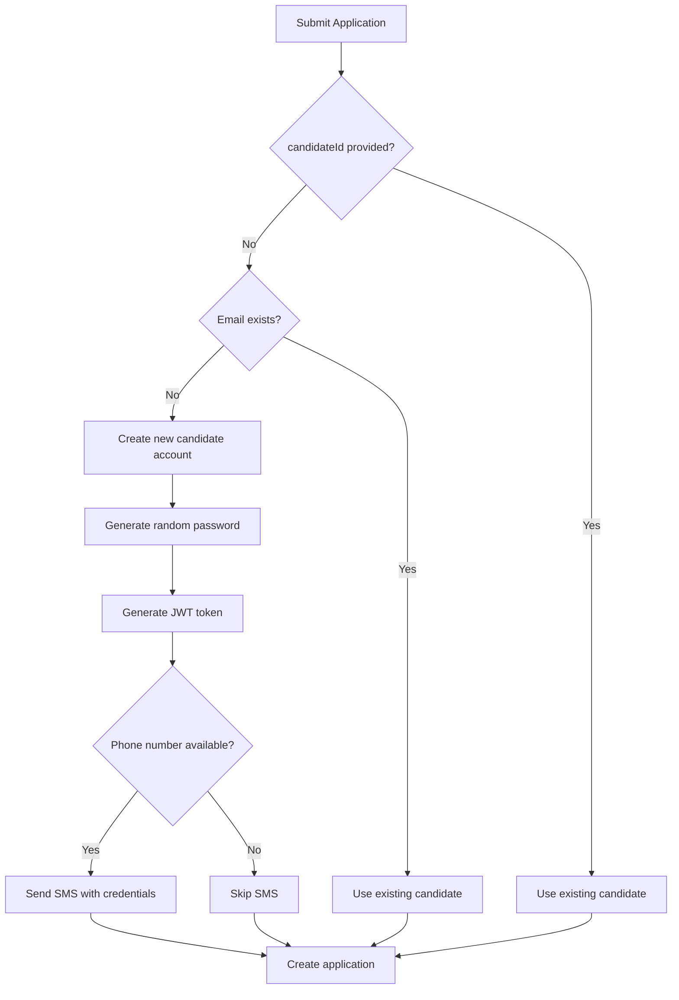

# SMS Login Credentials Feature

## Overview

When candidates apply anonymously without an existing account, the system automatically:
1. ✅ Creates a new candidate account
2. ✅ Generates a random 6-letter password
3. ✅ Generates a JWT token for immediate authentication
4. ✅ **Sends an SMS with login credentials** to their phone

## 📱 SMS Content

New candidates receive the following SMS:

```
Welcome to Rolevate!

Your application for "[Job Title]" has been submitted successfully.

Track your application:
🌐 rolevate.com

Login Details:
📧 Email: candidate@example.com
🔑 Password: AbCdEf

Please change your password after first login.
```

## 🔧 How It Works

### 1. Application Flow



### 2. Phone Number Handling

The system automatically formats phone numbers:

- **Input**: `0796026659` or `796026659` or `+962796026659`
- **Output**: `+962796026659` (E.164 format)

**Supported Formats:**
- `+962796026659` - Already formatted ✅
- `0796026659` - Adds +962 prefix
- `796026659` - Adds +962 prefix
- Jordan country code (+962) is assumed if no country code provided

### 3. SMS Service Integration

The application service uses the SMS service to send credentials:

```typescript
await this.smsService.sendSMS({
  phoneNumber: '+962796026659',
  message: 'Welcome to Rolevate! ...',
  type: SMSMessageType.GENERAL,
});
```

**Communication Tracking:**
- ✅ SMS is logged in the `communication` table
- ✅ Type: `SMS`
- ✅ Direction: `OUTBOUND`
- ✅ Status tracked: `SENT`, `DELIVERED`, `FAILED`
- ✅ Linked to candidate and application

## 🎯 Example Usage

### Anonymous Application with Phone

**GraphQL Mutation:**
```graphql
mutation CreateApplication($input: CreateApplicationInput!) {
  createApplication(input: $input) {
    application {
      id
      jobId
      candidateId
      status
    }
    candidateCredentials {
      email
      password
      token
    }
    message
  }
}
```

**Variables:**
```json
{
  "input": {
    "jobId": "02a0e4f8-f1f2-47d5-a0a0-0924504af0cd",
    "resumeUrl": "https://s3.amazonaws.com/bucket/cvs/resume.pdf",
    "email": "candidate@example.com",
    "firstName": "John",
    "lastName": "Doe",
    "phone": "0796026659",
    "coverLetter": "I'm interested..."
  }
}
```

**Response:**
```json
{
  "data": {
    "createApplication": {
      "application": {
        "id": "app-123",
        "jobId": "02a0e4f8-f1f2-47d5-a0a0-0924504af0cd",
        "candidateId": "candidate-456",
        "status": "PENDING"
      },
      "candidateCredentials": {
        "email": "candidate@example.com",
        "password": "AbCdEf",
        "token": "eyJhbGciOiJIUzI1NiIsInR5cCI6IkpXVCJ9..."
      },
      "message": "Application submitted successfully! Login credentials sent via SMS."
    }
  }
}
```

**SMS Sent To:** +962796026659

### What Candidate Receives

1. **API Response**: Password and JWT token
2. **SMS**: Login credentials message
3. **WhatsApp** (if configured): Interview invitation

## 📊 Backend Logging

The backend logs each step:

```
🔄 Processing anonymous application...
📄 Extracting candidate information from CV...
🆕 Creating new candidate account...
✅ Created new candidate account for: candidate@example.com
📱 Sending login credentials SMS to: 0796026659
✅ Login credentials SMS sent successfully to: +962796026659
```

## ⚙️ Configuration

### Environment Variables

Make sure these are set in your `.env`:

```env
# JOSMS Configuration
JOSMS_BASE_URL=https://josms.com/api/
JOSMS_USERNAME=your_username
JOSMS_API_KEY=your_api_key
JOSMS_SENDER_ID=Rolevate

# JWT Configuration (for token generation)
JWT_SECRET=your_jwt_secret
```

## 🛡️ Error Handling

### SMS Failure Won't Block Application

If SMS sending fails:
- ✅ Application is still created
- ✅ Credentials are still returned in API response
- ✅ Error is logged but not thrown
- ⚠️ Candidate doesn't receive SMS (but has credentials in response)

```typescript
try {
  await this.smsService.sendSMS({ ... });
  console.log('✅ SMS sent successfully');
} catch (error) {
  console.error('❌ Failed to send SMS:', error.message);
  // Don't throw - SMS failure shouldn't block application
}
```

### Common Issues

**1. No Phone Number Provided**
```typescript
// Solution: Extract from CV or request from user
if (!candidateInfo.phone) {
  console.log('⚠️ No phone number available, skipping SMS');
}
```

**2. Invalid Phone Format**
```typescript
// Solution: Phone number validation and formatting
let cleanPhone = phone.replace(/[\s\-()]/g, '');
if (!cleanPhone.startsWith('+')) {
  cleanPhone = '+962' + cleanPhone;
}
```

**3. JOSMS API Error**
```typescript
// Solution: Check JOSMS balance and credentials
const balance = await josmsService.getBalance();
console.log('JOSMS Balance:', balance);
```

## 🧪 Testing

### Test Script

```bash
# Create a test application
npx ts-node test-anonymous-application-sms.ts
```

**test-anonymous-application-sms.ts:**
```typescript
import { NestFactory } from '@nestjs/core';
import { AppModule } from './src/app.module';
import { ApplicationService } from './src/application/application.service';

async function testAnonymousApplication() {
  const app = await NestFactory.createApplicationContext(AppModule);
  const applicationService = app.get(ApplicationService);

  const result = await applicationService.createAnonymousApplication({
    jobId: 'your-job-id',
    resumeUrl: 'https://s3.amazonaws.com/bucket/test-resume.pdf',
    email: 'test@example.com',
    firstName: 'Test',
    lastName: 'User',
    phone: '0796026659', // Your test phone number
  });

  console.log('Application created:', result.application.id);
  console.log('Credentials:', result.candidateCredentials);
  console.log('Check your phone for SMS!');

  await app.close();
}

testAnonymousApplication();
```

### Manual Testing via GraphQL Playground

1. Go to: `http://localhost:4005/graphql`

2. Run mutation:
```graphql
mutation TestAnonymousApplication {
  createApplication(input: {
    jobId: "your-job-id-here"
    resumeUrl: "https://s3.amazonaws.com/bucket/resume.pdf"
    email: "test@example.com"
    firstName: "Test"
    lastName: "User"
    phone: "0796026659"
  }) {
    application { id }
    candidateCredentials {
      email
      password
      token
    }
    message
  }
}
```

3. Check your phone for SMS!

## 📈 Monitoring

### Database Queries

**Check SMS communications:**
```sql
SELECT 
  c.id,
  c.phone_number,
  c.content,
  c.status,
  c.sent_at,
  c.delivered_at,
  u.email as candidate_email
FROM communication c
JOIN user u ON c.candidate_id = u.id
WHERE c.type = 'SMS'
ORDER BY c.created_at DESC
LIMIT 10;
```

**Check applications with credentials sent:**
```sql
SELECT 
  a.id,
  a.status,
  u.email,
  cp.phone,
  a.created_at
FROM application a
JOIN user u ON a.candidate_id = u.id
JOIN candidate_profile cp ON cp.user_id = u.id
WHERE u.created_at > NOW() - INTERVAL '1 day'
ORDER BY a.created_at DESC;
```

## 🔐 Security Considerations

1. **Password Strength**: 6 letters (52^6 ≈ 19 billion combinations)
   - Sufficient for temporary password
   - Users should change it after first login

2. **SMS Security**:
   - Message contains plain text password (standard practice for registration)
   - Encourage users to change password immediately
   - Consider implementing password expiry

3. **Phone Number Privacy**:
   - Phone numbers stored securely in database
   - Only used for SMS notifications
   - Not shared with third parties

## 🚀 Best Practices

### For Frontend Developers

1. **Display Credentials Prominently:**
   ```javascript
   if (response.candidateCredentials) {
     showModal({
       title: '✅ Account Created!',
       message: `
         Your login credentials have been sent via SMS.
         
         Email: ${response.candidateCredentials.email}
         Password: ${response.candidateCredentials.password}
         
         Please save these or change your password.
       `,
       actions: ['Change Password', 'Continue']
     });
   }
   ```

2. **Auto-Login with Token:**
   ```javascript
   if (response.candidateCredentials?.token) {
     localStorage.setItem('authToken', response.candidateCredentials.token);
     navigate('/dashboard');
   }
   ```

3. **Handle SMS Failure Gracefully:**
   ```javascript
   showNotification({
     type: 'info',
     message: 'Login credentials have been created. Please save your password!'
   });
   ```

### For Backend Developers

1. **Always Provide Phone in Response:**
   - Even if SMS fails, return credentials in API

2. **Log Everything:**
   - SMS attempts
   - Phone number formatting
   - JOSMS API responses

3. **Don't Block on SMS:**
   - Use try-catch around SMS sending
   - Application creation should never fail due to SMS

## 📞 Support

### Common Questions

**Q: What if SMS is not received?**
A: Credentials are always returned in the API response. User can still login using those credentials.

**Q: What if phone number is invalid?**
A: SMS will fail silently. Application is still created. Check logs for errors.

**Q: Can I customize the SMS message?**
A: Yes! Edit the message in `application.service.ts` → `sendLoginCredentialsSMS()` method.

**Q: How much does each SMS cost?**
A: Check JOSMS pricing. Use `checkSMSBalance` GraphQL query to monitor balance.

**Q: Can I send to international numbers?**
A: Yes, but ensure proper country code. Currently defaults to Jordan (+962).

## 🎉 Success Metrics

Track these to measure success:
- ✅ Number of anonymous applications created
- ✅ SMS delivery rate
- ✅ Candidates who login after SMS
- ✅ Password change rate after first login

---

**Related Documentation:**
- [ANONYMOUS-APPLICATION-GUIDE.md](./ANONYMOUS-APPLICATION-GUIDE.md) - Complete application guide
- [SMS-SERVICE-GUIDE.md](./SMS-SERVICE-GUIDE.md) - SMS service documentation
- [GRAPHQL-FILE-UPLOAD-GUIDE.md](./GRAPHQL-FILE-UPLOAD-GUIDE.md) - File upload guide
